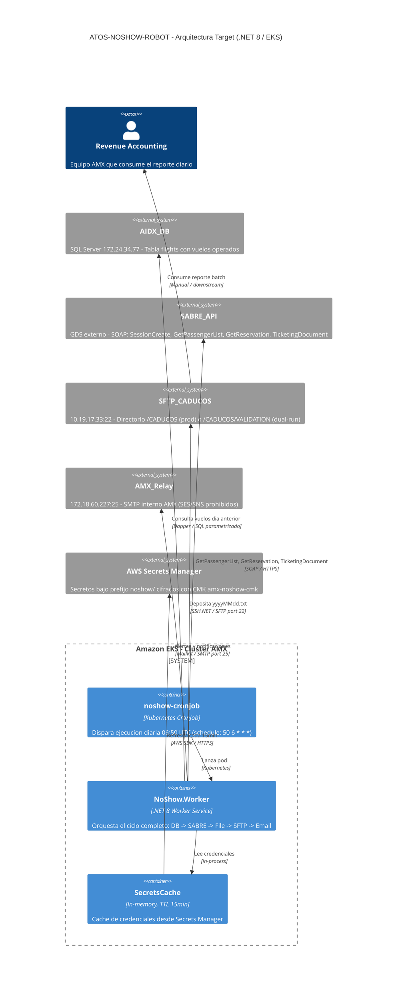
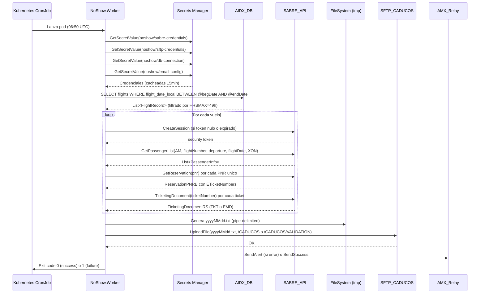

# Design Document
# ATOS-NOSHOW-ROBOT Modernizacion .NET 8 LTS sobre EKS

## Overview

ATOS-NOSHOW-ROBOT es un servicio batch de mision critica (Tier T1) que procesa ~1,350 no-shows diarios para Revenue Accounting de Aeromexico. El sistema actual corre sobre .NET 4.7.2 como Windows Service con Quartz.NET, alcanzando EOL en enero 2026.

Este documento describe la arquitectura target: un Worker Service en .NET 8 LTS desplegado como Kubernetes CronJob en Amazon EKS, con gestion de secretos via AWS Secrets Manager + CMK custom, logging estructurado con Serilog, retry policies con Polly, y migracion de WinSCP a SSH.NET para SFTP cross-platform.

### Hallazgos criticos que guian el diseno

| Hallazgo | Severidad | Decision de diseno |
|---|---|---|
| Vuelo 829 hardcoded (MainServices.cs:57) | CRITICO | Eliminar; usar datos reales de AIDX_DB |
| 6 credenciales plaintext | CRITICO | AWS Secrets Manager + CMK amx-noshow-cmk |
| Remove en iteracion (MainServices.cs:87) | HIGH | Reescribir con ToList() snapshot antes de iterar |
| SABRE sin retry (162 calls, 0 retry) | HIGH | Polly: 3 intentos, backoff 2/5/10s |
| IDisposable sin using (3 casos) | MEDIUM | using statements en SqlConnection, FileStream, SmtpClient |
| Console.WriteLine (18 ocurrencias) | MEDIUM | Serilog JSON sink |
| ECS prohibido (AMX constraint) | BLOQUEADOR | EKS CronJob obligatorio |
| SES/SNS prohibido (AMX constraint) | BLOQUEADOR | MailKit hacia AMX_Relay 172.18.60.227:25 |


## Architecture

### C4 Level 2 - Container Diagram (Mermaid)



### ADR-001: Runtime de ejecucion - Worker Service vs Console App

**Contexto:** El sistema legacy usa Quartz.NET como scheduler interno dentro de un Windows Service. En .NET 8 sobre EKS, el scheduling puede delegarse a Kubernetes CronJob.

**Opcion A: .NET 8 Worker Service con IHostedService**
- Pro: Ciclo de vida gestionado por .NET Generic Host; DI nativa; graceful shutdown con CancellationToken; compatible con health checks de K8s
- Pro: Permite ejecutar logica de startup (carga de secretos, validacion de config) antes del trabajo principal
- Contra: Requiere que el pod termine con exit code 0 al finalizar (gestionable con IHostApplicationLifetime.StopApplication())

**Opcion B: Console App simple (.NET 8)**
- Pro: Mas simple; menos overhead
- Contra: Sin DI nativa; sin graceful shutdown estandarizado; mas dificil de testear; no aprovecha Generic Host

**Decision: Opcion A - Worker Service**
Razon: El Generic Host provee DI, logging, configuracion y ciclo de vida estandarizados. El CronJob de Kubernetes gestiona el scheduling externo; el Worker Service ejecuta una sola vez y termina. Esto elimina Quartz.NET como dependencia.

---

### ADR-002: Gestion de secretos - Secrets Manager vs Parameter Store

**Contexto:** 6 credenciales en texto plano deben migrarse. AMX requiere CMK custom por servicio.

**Opcion A: AWS Secrets Manager + CMK custom amx-noshow-cmk**
- Pro: Soporte nativo para rotacion automatica; SDK con cache integrado (AWSSDK.SecretsManager.Caching); cifrado con CMK custom; auditoria via CloudTrail
- Pro: Cumple constraint AMX: una CMK por servicio
- Contra: Costo marginal por llamada (mitigado con cache 15min)

**Opcion B: AWS Systems Manager Parameter Store (SecureString)**
- Pro: Mas economico; integrado con IAM
- Contra: Sin rotacion automatica nativa para credenciales de terceros; limite de 4KB por parametro (insuficiente para config compleja); CMK compartida por defecto

**Decision: Opcion A - Secrets Manager**
Razon: Rotacion automatica, cache SDK, y alineacion directa con el constraint AMX de CMK por servicio. El costo adicional es despreciable para un batch diario.

---

### ADR-003: Cliente SFTP - SSH.NET vs WinSCP

**Contexto:** WinSCP es Windows-only. El contenedor target es Linux (mcr.microsoft.com/dotnet/runtime:8.0).

**Opcion A: SSH.NET (Renci.SshNet)**
- Pro: Cross-platform; ya usado en el codigo legacy (SFTPAdapter.cs usa SftpClient de Renci.SshNet); sin cambio de API
- Pro: Activamente mantenido; NuGet oficial
- Contra: Ninguno relevante para este caso de uso

**Opcion B: WinSCP .NET Assembly**
- Pro: UI familiar para operadores Windows
- Contra: PROHIBIDO en contenedores Linux; requiere WinSCP.exe instalado; no compatible con imagen base .NET 8 Linux

**Decision: Opcion A - SSH.NET**
Razon: Ya es la libreria en uso en el codigo legacy. WinSCP es incompatible con Linux containers. Cero cambio de API requerido.

---

### ADR-004: Cliente SMTP - SmtpClient vs MailKit

**Contexto:** System.Net.Mail.SmtpClient esta marcado como obsoleto en .NET 8 (CS0618). AMX_Relay es SMTP sin TLS en puerto 25.

**Opcion A: MailKit (MimeKit + MailKit)**
- Pro: Recomendado oficialmente por Microsoft como reemplazo de SmtpClient; soporte async nativo; activamente mantenido
- Pro: Soporte explicito para SMTP sin autenticacion (relay interno)
- Contra: Dependencia adicional (NuGet)

**Opcion B: System.Net.Mail.SmtpClient**
- Pro: Sin dependencias adicionales
- Contra: Obsoleto en .NET 8; sin soporte async real; Microsoft recomienda migrar a MailKit

**Decision: Opcion A - MailKit**
Razon: SmtpClient esta obsoleto. MailKit es el reemplazo oficial recomendado por Microsoft y soporta el relay interno AMX sin autenticacion.


## Components and Interfaces

### Estructura de solucion .NET 8

```
NoShow.sln
├── src/
│   ├── NoShow.Worker/                    # Proyecto principal - Worker Service
│   │   ├── Program.cs                    # Generic Host bootstrap
│   │   ├── Worker.cs                     # IHostedService - punto de entrada del ciclo
│   │   ├── appsettings.json              # Config no-sensible (cron, paths, timeouts)
│   │   └── NoShow.Worker.csproj
│   │
│   ├── NoShow.Core/                      # Logica de negocio (sin dependencias de infra)
│   │   ├── Services/
│   │   │   ├── IFlightService.cs
│   │   │   ├── ISabreService.cs
│   │   │   ├── IReportService.cs
│   │   │   └── INotificationService.cs
│   │   ├── Models/
│   │   │   ├── FlightRecord.cs           # Reemplaza FlightDTO
│   │   │   ├── PassengerRecord.cs        # Reemplaza pnrInfo
│   │   │   ├── TicketRecord.cs           # Reemplaza TicketingDTO
│   │   │   └── EmdRecord.cs              # Reemplaza EMDsDTO
│   │   ├── Pipeline/
│   │   │   └── NoshowPipeline.cs         # Orquestador del ciclo completo
│   │   └── NoShow.Core.csproj
│   │
│   ├── NoShow.Infrastructure/            # Implementaciones de infra (DB, SABRE, SFTP, Email)
│   │   ├── Data/
│   │   │   ├── AidxDbContext.cs          # Dapper connection factory
│   │   │   └── FlightRepository.cs       # Reemplaza FlightDAO + AIDXBD
│   │   ├── Sabre/
│   │   │   ├── SabreSessionManager.cs    # Gestion de token + renovacion
│   │   │   └── SabreClient.cs            # Reemplaza SabreAdapter + SabreBO
│   │   ├── Sftp/
│   │   │   └── SftpUploader.cs           # Reemplaza SFTPAdapter (SSH.NET)
│   │   ├── Email/
│   │   │   └── MailKitEmailSender.cs     # Reemplaza EmailAdapter (MailKit)
│   │   ├── Secrets/
│   │   │   └── SecretsManagerProvider.cs # Cache 15min + AWS SDK
│   │   └── NoShow.Infrastructure.csproj
│   │
│   └── NoShow.FileGeneration/            # Generacion del archivo batch
│       ├── ReportBuilder.cs              # Reemplaza logica de MainServices.Run()
│       ├── ReportLineFormatter.cs        # Formateo pipe-delimited
│       └── NoShow.FileGeneration.csproj
│
└── tests/
    ├── NoShow.Core.Tests/                # Tests unitarios + property-based
    │   ├── ReportBuilderTests.cs
    │   ├── PassengerFilterTests.cs
    │   └── PiiMaskingTests.cs
    └── NoShow.Core.Tests.csproj
```

### Interfaces principales

```csharp
// NoShow.Core/Services/IFlightService.cs
public interface IFlightService
{
    Task<IReadOnlyList<FlightRecord>> GetFlightsForYesterdayAsync(
        CancellationToken ct = default);
}

// NoShow.Core/Services/ISabreService.cs
public interface ISabreService
{
    Task<IReadOnlyList<PassengerRecord>> GetPassengersAsync(
        FlightRecord flight, CancellationToken ct = default);
    Task EnrichWithTicketsAsync(
        IReadOnlyList<PassengerRecord> passengers, CancellationToken ct = default);
    Task EnrichWithTicketingInfoAsync(
        IReadOnlyList<PassengerRecord> passengers, CancellationToken ct = default);
}

// NoShow.Core/Services/IReportService.cs
public interface IReportService
{
    Task<ReportResult> GenerateAndUploadAsync(
        IReadOnlyList<PassengerRecord> passengers,
        DateRange processingRange,
        CancellationToken ct = default);
}

// NoShow.Core/Services/INotificationService.cs
public interface INotificationService
{
    Task SendAlertAsync(string subject, string body, CancellationToken ct = default);
    Task SendSuccessAsync(ReportResult result, CancellationToken ct = default);
}

// NoShow.Infrastructure/Secrets/ISecretsProvider.cs
public interface ISecretsProvider
{
    Task<SabreCredentials> GetSabreCredentialsAsync(CancellationToken ct = default);
    Task<SftpCredentials> GetSftpCredentialsAsync(CancellationToken ct = default);
    Task<DbConnectionConfig> GetDbConnectionAsync(CancellationToken ct = default);
    Task<EmailConfig> GetEmailConfigAsync(CancellationToken ct = default);
}
```

### Flujo de datos principal (Sequence Diagram)




## Data Models

### Modelos de dominio (.NET 8)

```csharp
// NoShow.Core/Models/FlightRecord.cs
// Reemplaza FlightEntity + FlightDTO (consolida capas)
public sealed record FlightRecord
{
    public required string FlightNumber { get; init; }
    public required string DepartureAirport { get; init; }
    public required string ArrivalAirport { get; init; }
    public required DateTime FlightDateLocal { get; init; }
    public required string DepartureIndoIndicator { get; init; }  // isNac
    public required DateTime ActualTakeOff { get; init; }

    // Invariante: FlightNumber no puede ser nulo ni vacio (Req 14.3)
    public bool IsValid => !string.IsNullOrWhiteSpace(FlightNumber);
}

// NoShow.Core/Models/PassengerRecord.cs
// Reemplaza pnrInfo - nombre en PascalCase, PII marcada explicitamente
public sealed record PassengerRecord
{
    public required string Pnr { get; init; }                    // PII - enmascarar en logs
    public required int TotalSegments { get; init; }
    public required string FlightNumber { get; init; }
    public required string Departure { get; init; }
    public required string Arrival { get; init; }
    public required string FlightDate { get; init; }
    public required string BookingClass { get; init; }
    public required string NameAssociationId { get; init; }
    public string? PassengerName { get; init; }                  // PII - enmascarar en logs
    public string? FirstName { get; init; }                      // PII
    public string? LastName { get; init; }                       // PII
    public string? Ancillaries { get; init; }
    public string? AncilliariesCodes { get; init; }
    public string? AncilliariesSubCodes { get; init; }
    public List<TicketRecord> Tickets { get; init; } = new();
}

// NoShow.Core/Models/TicketRecord.cs
// Reemplaza TicketingDTO
public sealed record TicketRecord
{
    public required string OriginalTicket { get; init; }
    public required string TicketNumber { get; init; }           // PII - mostrar solo ultimos 4 en logs
    public string? StationNumber { get; init; }
    public string? PassengerName { get; init; }                  // PII
    public string? SaleDate { get; init; }
    public string? DocumentType { get; init; }
    public string? AssociatedFareBasis { get; init; }
    public string? CouponNumber { get; init; }
    public string? FareRule { get; init; }
    public string? MarketingProvider { get; init; }
    public string? CurrentStatus { get; init; }
    public string? Remark { get; init; }
    public string Itinerary { get; init; } = string.Empty;
    public bool IsValid { get; init; }
    public string? Endosos { get; init; }
    public int EmdType { get; init; }
    public List<EmdRecord> Emds { get; init; } = new();
}

// NoShow.Core/Models/EmdRecord.cs
// Reemplaza EMDsDTO
public sealed record EmdRecord
{
    public required string EmdNumber { get; init; }
    public string? EmdRuta { get; init; }
    public string? EmdTipo { get; init; }
    public string? EmdGrupo { get; init; }
    public string? VcrAsociado { get; init; }
    public string? EmdEstatus { get; init; }
    public string? EmdSubCodigo { get; init; }
    public string? EmdCodigo { get; init; }
    public string? CreationDate { get; init; }
    public string? EmdAssociatedFareBasis { get; init; }
}

// NoShow.Core/Models/ReportResult.cs
public sealed record ReportResult
{
    public required string FileName { get; init; }
    public required int TotalDRecords { get; init; }
    public required DateRange ProcessingRange { get; init; }
    public required DateTime GeneratedAt { get; init; }
    public required bool UploadedSuccessfully { get; init; }
    public string? SftpPath { get; init; }
}

// NoShow.Core/Models/DateRange.cs
public sealed record DateRange(DateTime Start, DateTime End)
{
    // Invariante: Start <= End
    public bool IsValid => Start <= End;
}
```

### Modelos de configuracion (desde Secrets Manager)

```csharp
// NoShow.Infrastructure/Secrets/Models/
public sealed record SabreCredentials(
    string Username, string Password, string Ipcc, string SubjectArea);

public sealed record SftpCredentials(
    string Host, int Port, string Username, string Passphrase);

public sealed record DbConnectionConfig(
    string Server, string Database, string Uid, string Password)
{
    public string ToConnectionString() =>
        $"Server={Server};Database={Database};User Id={Uid};Password={Password};TrustServerCertificate=True;";
}

public sealed record EmailConfig(
    string[] ToAddress, string[] CcAddress, string FromAddress);
```

### Constantes de negocio (sin cambio semantico)

```csharp
// NoShow.Core/Constants.cs
public static class NoshowConstants
{
    public const string AirlineCode = "AM";
    public const string DefaultDisplayCode = "XON";
    public const string Rac474Code = "RAC474";
    public const int MaxFlightAgeHours = 49;
    public const int SabreRetryCount = 3;
    public const int DbRetryCount = 3;
    public const int SecretsCacheTtlMinutes = 15;
    public const int SftpBufferSize = 4096;
    public const int SmtpPort = 25;
    public const string SmtpHost = "172.18.60.227";  // AMX_Relay - no SES/SNS
    public const string SftpProductionPath = "/CADUCOS";
    public const string SftpValidationPath = "/CADUCOS/VALIDATION";

    public static readonly IReadOnlySet<string> ExcludedStatuses =
        new HashSet<string> { "USED", "VOID", "EXCH", "RFND" };

    public static readonly IReadOnlySet<string> OutOfScopePrefixes =
        new HashSet<string> { "139047", "139048", "139049" };
}
```

### Esquema de base de datos (sin cambios - AIDX_DB)

```sql
-- Tabla existente en AIDX_DB (solo lectura, sin modificaciones)
-- Query parametrizado (Req 2.5 - no interpolacion de strings)
SELECT
    flight_Number,
    latest_Departure_Airport,
    latest_Arrival_Airport,
    flight_date_local,
    departure_indo_indicator,
    actual_take_off
FROM flights
WHERE flight_date_local BETWEEN @begDate AND @endDate
ORDER BY flight_date_local;
```


## Secrets Strategy

### Paths en AWS Secrets Manager

| Secret Path | Contenido JSON | Consumidor |
|---|---|---|
| `noshow/sabre-credentials` | `{"username":"...","password":"...","ipcc":"AM","subjectArea":"FULL"}` | SabreClient |
| `noshow/sftp-credentials` | `{"host":"10.19.17.33","port":22,"username":"AMUSER","passphrase":"..."}` | SftpUploader |
| `noshow/db-connection` | `{"server":"172.24.34.77","database":"AIDX","uid":"...","password":"..."}` | FlightRepository |
| `noshow/email-config` | `{"toAddress":[...],"ccAddress":[...],"fromAddress":"amnoshow@aeromexico.com"}` | MailKitEmailSender |

**CMK:** `amx-noshow-cmk` - exclusiva de este servicio, no compartida (constraint AMX).

### Implementacion de cache (15 minutos)

```csharp
// NoShow.Infrastructure/Secrets/SecretsManagerProvider.cs
public sealed class SecretsManagerProvider : ISecretsProvider
{
    private readonly IAmazonSecretsManager _client;
    private readonly ILogger<SecretsManagerProvider> _logger;
    private readonly TimeSpan _cacheTtl = TimeSpan.FromMinutes(15);

    // Cache por secret path
    private readonly ConcurrentDictionary<string, (object Value, DateTime ExpiresAt)> _cache = new();

    private async Task<T> GetCachedSecretAsync<T>(string secretId, CancellationToken ct)
    {
        if (_cache.TryGetValue(secretId, out var cached) && cached.ExpiresAt > DateTime.UtcNow)
            return (T)cached.Value;

        _logger.LogInformation("SecretsManager: Refreshing secret {SecretName}", secretId);
        var response = await _client.GetSecretValueAsync(
            new GetSecretValueRequest { SecretId = secretId }, ct);

        var value = JsonSerializer.Deserialize<T>(response.SecretString)!;
        _cache[secretId] = (value, DateTime.UtcNow.Add(_cacheTtl));

        // Audit log: nombre del secreto, NO el valor (Req 12.2)
        _logger.LogInformation(
            "SecretsManager: Secret {SecretName} refreshed at {Timestamp}",
            secretId, DateTime.UtcNow);

        return value;
    }
}
```

### IAM Role (prefijo amx-r-* obligatorio)

```json
{
  "RoleName": "amx-r-noshow-execution",
  "AssumeRolePolicyDocument": {
    "Statement": [{
      "Effect": "Allow",
      "Principal": { "Service": "pods.eks.amazonaws.com" },
      "Action": "sts:AssumeRoleWithWebIdentity"
    }]
  },
  "Policies": [{
    "PolicyName": "amx-p-noshow-secrets",
    "Statement": [
      {
        "Effect": "Allow",
        "Action": ["secretsmanager:GetSecretValue"],
        "Resource": "arn:aws:secretsmanager:us-east-1:*:secret:noshow/*"
      },
      {
        "Effect": "Allow",
        "Action": ["kms:Decrypt"],
        "Resource": "arn:aws:kms:us-east-1:*:key/amx-noshow-cmk-*"
      }
    ]
  }]
}
```


---

## ADR-005: Orquestación de ejecución batch — EKS CronJob vs Step Functions + Lambda chain

**Contexto:** El Req NF-02 (Req 1.5) fija un ciclo máximo de **90 minutos**. El ciclo procesa ~1,350 no-shows con ~162 llamadas SOAP a SABRE de forma secuencial por vuelo. AWS Lambda tiene un tope de ejecución de **15 minutos por invocación**.

**Opción A: EKS CronJob (pod único .NET 8)**
- Pro: Sin tope de duración; el ciclo completo corre en un único proceso con estado en memoria
- Pro: Sin coordinación entre chunks; el token SABRE se gestiona en proceso sin serialización
- Pro: Latencia determinística; sin overhead de orquestación externa
- Pro: Simplicidad operativa: un solo artefacto, un solo log stream, un solo punto de fallo
- Contra: Si el pod falla a mitad del ciclo, no hay checkpoint; K8s reintenta el Job completo (aceptable dado RPO=24h)

**Opción B: Step Functions + Lambdas con chunking por lotes de PNRs**
- Pro: Serverless; sin gestión de nodos EKS para este job
- Pro: Visibilidad de estado por step en la consola de Step Functions
- Contra: Lambda tope 15 min obliga a chunking de PNRs → coordinación de estado entre invocaciones
- Contra: El token SABRE debe serializarse y pasarse entre Lambdas (complejidad + riesgo de expiración entre chunks)
- Contra: Mayor costo operativo: definición de state machine, manejo de errores por step, reintentos distribuidos
- Contra: Latencia no determinística por cold starts y overhead de orquestación

**Decisión: Opción A — EKS CronJob**

Razón: La simplicidad operativa de un proceso único supera los beneficios de serverless para este caso de uso. El estado SABRE (token de sesión) se gestiona en proceso sin serialización. La latencia es determinística. El constraint de 90 minutos es alcanzable con el volumen actual (~1,350 no-shows). Si el volumen escala 10x en el futuro, se puede paralelizar por vuelo dentro del mismo pod antes de considerar Step Functions.

---

## Error Handling

### Polly: Retry + Circuit Breaker

```csharp
// NoShow.Infrastructure/Resilience/ResiliencePolicies.cs

// Retry policy para SABRE, DB y SFTP
// Backoff exponencial: 2s, 5s, 10s (Req 3.5, Req 2.4)
public static IAsyncPolicy<T> GetRetryPolicy<T>(ILogger logger, string operationName) =>
    Policy<T>
        .Handle<Exception>(ex => ex is not OperationCanceledException)
        .WaitAndRetryAsync(
            retryCount: 3,
            sleepDurationProvider: attempt => attempt switch
            {
                1 => TimeSpan.FromSeconds(2),
                2 => TimeSpan.FromSeconds(5),
                _ => TimeSpan.FromSeconds(10)
            },
            onRetry: (outcome, timespan, attempt, _) =>
                logger.LogWarning(
                    "Retry {Attempt}/3 for {Operation} after {Delay}s. Error: {Error}",
                    attempt, operationName, timespan.TotalSeconds,
                    SanitizeException(outcome.Exception)));

// Circuit breaker para SABRE (threshold 5 fallas consecutivas · break 30s)
public static IAsyncPolicy GetSabreCircuitBreaker(ILogger logger) =>
    Policy
        .Handle<Exception>()
        .CircuitBreakerAsync(
            exceptionsAllowedBeforeBreaking: 5,
            durationOfBreak: TimeSpan.FromSeconds(30),
            onBreak: (ex, duration) =>
                logger.LogError(
                    "SABRE circuit breaker OPEN for {Duration}s. Last error: {Error}",
                    duration.TotalSeconds, SanitizeException(ex)),
            onReset: () =>
                logger.LogInformation("SABRE circuit breaker CLOSED — resuming calls"),
            onHalfOpen: () =>
                logger.LogInformation("SABRE circuit breaker HALF-OPEN — testing"));
```

### Timeout por llamada SOAP

```csharp
// HttpClient configurado en DI registration (NoShow.Worker/Program.cs)
services.AddHttpClient("SabreSOAP", client =>
{
    client.Timeout = TimeSpan.FromSeconds(30); // Timeout por call SOAP
    client.BaseAddress = new Uri(sabreEndpoint);
});
```

### Exception Sanitization (Req 10.6 / Req 12)

```csharp
// NoShow.Infrastructure/Resilience/ExceptionSanitizer.cs
// Remueve securityToken de stacktraces antes de loggear
public static class ExceptionSanitizer
{
    // Regex para tokens SABRE (formato: securityToken="..." o <securityToken>...</securityToken>)
    private static readonly Regex TokenPattern = new(
        @"(securityToken[""=>\s]+)[^\s""<&]+",
        RegexOptions.Compiled | RegexOptions.IgnoreCase);

    public static string Sanitize(Exception? ex)
    {
        if (ex is null) return string.Empty;
        var raw = ex.ToString();
        return TokenPattern.Replace(raw, "$1[REDACTED]");
    }

    public static string Sanitize(string message) =>
        TokenPattern.Replace(message ?? string.Empty, "$1[REDACTED]");
}
```

### Fallback: fallo SFTP tras retries

Si `SftpUploader` falla tras los 3 reintentos con backoff:
1. El pod termina con **exit code 1**
2. Kubernetes marca el Job como `Failed`
3. Se envía alerta a AMX_Relay con subject `[NOSHOW][CRITICAL] SFTP upload failed`
4. K8s aplica `restartPolicy: OnFailure` (máximo 3 reintentos del Job completo según `backoffLimit: 3`)

```csharp
// NoShow.Core/Pipeline/NoshowPipeline.cs — fragmento de manejo de fallo SFTP
catch (SftpUploadException ex)
{
    _logger.LogError("SFTP upload failed after retries. CorrelationId: {CorrelationId}", _correlationId);
    await _notifications.SendAlertAsync(
        subject: "[NOSHOW][CRITICAL] SFTP upload failed",
        body: $"CorrelationId: {_correlationId}\nDate: {processingDate:yyyy-MM-dd}\nError: {ExceptionSanitizer.Sanitize(ex)}");
    _appLifetime.StopApplication(); // Provoca exit code 1 via IHostApplicationLifetime
}
```

---

## Testing Strategy

### Unit Tests (xUnit)

Proyecto: `tests/NoShow.Core.Tests/`

| Clase bajo prueba | Tests clave |
|---|---|
| `ReportBuilder` | Genera línea H con conteo correcto; excluye statuses USED/VOID/EXCH/RFND; excluye prefijos 139047/139048/139049; no sobreescribe archivo existente |
| `PassengerFilter` | Excluye pasajeros con PNRLocator null; incluye EMDs con tipo != "S" y estatus != "USED" |
| `PiiMasking` | PNR → `***AB`; nombre → `J.***`; ticket → `***1234`; no expone credenciales en log |
| `ReportLineFormatter` | Formato pipe-delimited correcto; 24 columnas; línea H con tokens reemplazados |

Cobertura objetivo: **80% en NoShow.Core** (medido con Coverlet + reportgenerator).

### Property-Based Tests (FsCheck)

```csharp
// tests/NoShow.Core.Tests/Properties/FlightRecordProperties.cs
public class FlightRecordProperties
{
    // Invariante: FlightRecord.IsValid ↔ FlightNumber no es nulo ni vacío (Req 14.3)
    [Property]
    public Property IsValid_IFF_FlightNumberNotEmpty() =>
        Prop.ForAll(
            Arb.From<string>(),
            flightNumber =>
            {
                var record = new FlightRecord
                {
                    FlightNumber = flightNumber,
                    DepartureAirport = "MEX",
                    ArrivalAirport = "GDL",
                    FlightDateLocal = DateTime.Today,
                    DepartureIndoIndicator = "N",
                    ActualTakeOff = DateTime.UtcNow
                };
                return record.IsValid == !string.IsNullOrWhiteSpace(flightNumber);
            });

    // Invariante: DateRange.IsValid ↔ Start <= End
    [Property]
    public Property DateRange_IsValid_IFF_StartLteEnd() =>
        Prop.ForAll(
            Arb.From<DateTime>(),
            Arb.From<DateTime>(),
            (start, end) =>
            {
                var range = new DateRange(start, end);
                return range.IsValid == (start <= end);
            });
}
```

### Integration Tests

| Componente | Herramienta | Descripción |
|---|---|---|
| `FlightRepository` | Testcontainers (SQL Server) | Verifica query parametrizado contra DB real en contenedor; valida filtro de 49h |
| `SabreClient` | WireMock.Net | Simula respuestas SOAP de GetPassengerList, GetReservation, TicketingDocument; valida retry ante token expirado |
| `SftpUploader` | Testcontainers (OpenSSH `atmoz/sftp`) | Verifica upload real a contenedor SFTP; valida buffer 4096 bytes; valida ruta /CADUCOS |

### Smoke Test post-deploy

```bash
# Ejecución manual con flag --dry-run
# Genera archivo en /CADUCOS/VALIDATION sin enviar notificaciones por correo
# Útil para validar conectividad y credenciales en nuevo entorno

kubectl create job noshow-smoke-$(date +%s) \
  --from=cronjob/noshow-cronjob \
  --namespace=revenue \
  -- dotnet NoShow.Worker.dll --dry-run
```

En modo `--dry-run`:
- Se conecta a AIDX_DB y SABRE_API normalmente
- Genera el archivo en `/CADUCOS/VALIDATION` (nunca en `/CADUCOS`)
- **No envía correos** (INotificationService → NullNotificationService)
- Termina con exit code 0 si el archivo se generó correctamente

---

## Deployment

### Dockerfile multi-stage (Linux · NO Windows)

```dockerfile
# Stage 1: Build
FROM mcr.microsoft.com/dotnet/sdk:8.0 AS build
WORKDIR /src
COPY ["src/NoShow.Worker/NoShow.Worker.csproj", "src/NoShow.Worker/"]
COPY ["src/NoShow.Core/NoShow.Core.csproj", "src/NoShow.Core/"]
COPY ["src/NoShow.Infrastructure/NoShow.Infrastructure.csproj", "src/NoShow.Infrastructure/"]
COPY ["src/NoShow.FileGeneration/NoShow.FileGeneration.csproj", "src/NoShow.FileGeneration/"]
RUN dotnet restore "src/NoShow.Worker/NoShow.Worker.csproj"
COPY . .
RUN dotnet publish "src/NoShow.Worker/NoShow.Worker.csproj" \
    -c Release -o /app/publish --no-restore

# Stage 2: Runtime (Linux · imagen oficial .NET 8 LTS)
FROM mcr.microsoft.com/dotnet/runtime:8.0 AS runtime
WORKDIR /app

# Usuario no-root (hardening)
RUN addgroup --system noshow && adduser --system --ingroup noshow noshow
USER noshow

COPY --from=build /app/publish .
ENTRYPOINT ["dotnet", "NoShow.Worker.dll"]
```

**Imagen pushed a ECR AMX** — no a GitHub Packages ni Docker Hub.

### Kubernetes CronJob Manifest

```yaml
# infra/k8s/noshow-cronjob.yaml
apiVersion: batch/v1
kind: CronJob
metadata:
  name: noshow-cronjob
  namespace: revenue
  labels:
    app: noshow-robot
    tier: t1
    team: revenue-accounting
spec:
  schedule: "50 6 * * *"           # 06:50 UTC diario (Req 1.1)
  concurrencyPolicy: Forbid         # No ejecutar si el anterior aún corre
  startingDeadlineSeconds: 600      # Alerta si no inicia en 10min tras la hora programada
  successfulJobsHistoryLimit: 3
  failedJobsHistoryLimit: 5
  jobTemplate:
    spec:
      backoffLimit: 3               # Máximo 3 reintentos del Job completo
      template:
        metadata:
          annotations:
            eks.amazonaws.com/role-arn: arn:aws:iam::ACCOUNT_ID:role/amx-r-noshow-execution
        spec:
          restartPolicy: OnFailure
          serviceAccountName: noshow-sa  # IRSA apunta a amx-r-noshow-execution
          containers:
            - name: noshow-worker
              image: ACCOUNT_ID.dkr.ecr.us-east-1.amazonaws.com/amx/noshow-robot:latest
              imagePullPolicy: Always
              env:
                - name: NOSHOW_MODE
                  value: "PRODUCTION"   # DUAL_RUN durante migración
                - name: NOSHOW_OUTPUT_PATH
                  value: "/tmp/noshow"
                - name: DOTNET_ENVIRONMENT
                  value: "Production"
              resources:
                requests:
                  memory: "512Mi"
                  cpu: "500m"
                limits:
                  memory: "2Gi"       # Headroom para picos de procesamiento
                  cpu: "1000m"
              securityContext:
                runAsNonRoot: true
                readOnlyRootFilesystem: false  # Necesario para /tmp/noshow
                allowPrivilegeEscalation: false
```

### IRSA (IAM Roles for Service Accounts)

```yaml
# infra/k8s/noshow-serviceaccount.yaml
apiVersion: v1
kind: ServiceAccount
metadata:
  name: noshow-sa
  namespace: revenue
  annotations:
    eks.amazonaws.com/role-arn: arn:aws:iam::ACCOUNT_ID:role/amx-r-noshow-execution
```

El rol `amx-r-noshow-execution` tiene permisos mínimos: `secretsmanager:GetSecretValue` y `kms:Decrypt` sobre `noshow/*` (ver sección Secrets Strategy).

### Helm Chart

```
infra/helm/noshow-robot/
├── Chart.yaml
├── values.yaml          # Valores por defecto
├── values.prod.yaml     # Overrides de producción
└── templates/
    ├── cronjob.yaml
    ├── serviceaccount.yaml
    └── configmap.yaml
```

Parámetros parametrizables en `values.yaml`:

```yaml
image:
  repository: ACCOUNT_ID.dkr.ecr.us-east-1.amazonaws.com/amx/noshow-robot
  tag: "latest"           # Overrideado por CI/CD con SHA del commit

schedule: "50 6 * * *"

noshow:
  mode: "PRODUCTION"      # DUAL_RUN | PRODUCTION
  outputPath: "/tmp/noshow"
  logLevel: "Information" # Debug | Information | Warning | Error

resources:
  requests:
    memory: "512Mi"
    cpu: "500m"
  limits:
    memory: "2Gi"
    cpu: "1000m"
```

---

## Observability

### Logging estructurado con Serilog

```csharp
// NoShow.Worker/Program.cs — configuración de Serilog
Log.Logger = new LoggerConfiguration()
    .MinimumLevel.Information()
    .Enrich.WithProperty("Service", "noshow-robot")
    .Enrich.WithProperty("Environment", Environment.GetEnvironmentVariable("DOTNET_ENVIRONMENT"))
    .Enrich.FromLogContext()  // CorrelationId, ProcessingDate inyectados por NoshowPipeline
    .WriteTo.Console(new JsonFormatter())  // stdout → FluentBit → CloudWatch Logs
    .CreateLogger();
```

**Sink:** JSON a stdout → recolectado por **FluentBit** (DaemonSet en EKS) → **CloudWatch Logs** grupo `/amx/noshow`.

**Enrichers por ciclo** (inyectados vía `LogContext.PushProperty`):
- `CorrelationId` — UUID v4 único por ejecución (Req 12.5)
- `ProcessingDate` — fecha del día anterior procesado
- `Environment` — Production | Staging

### Métricas custom a CloudWatch

| Métrica | Namespace | Descripción |
|---|---|---|
| `NoShowRecordsProcessed` | `AMX/NoShow` | Total registros D generados por ciclo |
| `SabreCallsTotal` | `AMX/NoShow` | Total llamadas SOAP a SABRE por ciclo |
| `SabreCallsFailed` | `AMX/NoShow` | Llamadas SABRE fallidas (tras retries) |
| `SftpUploadDurationMs` | `AMX/NoShow` | Duración de la transferencia SFTP en ms |
| `CycleDurationMs` | `AMX/NoShow` | Duración total del ciclo en ms |

```csharp
// NoShow.Infrastructure/Observability/CloudWatchMetricsPublisher.cs
await _cloudWatch.PutMetricDataAsync(new PutMetricDataRequest
{
    Namespace = "AMX/NoShow",
    MetricData = new List<MetricDatum>
    {
        new() { MetricName = "NoShowRecordsProcessed", Value = totalRecords, Unit = StandardUnit.Count },
        new() { MetricName = "CycleDurationMs", Value = elapsed.TotalMilliseconds, Unit = StandardUnit.Milliseconds }
    }
});
```

### Alarmas CloudWatch

| Alarma | Condición | Acción |
|---|---|---|
| `noshow-sftp-failed` | `SftpUploadDurationMs` sin datos en 24h (upload no ocurrió) | SNS → equipo Revenue (no correo) |
| `noshow-records-low` | `NoShowRecordsProcessed < 500` en cualquier ciclo | SNS → equipo Revenue (umbral mínimo operativo) |
| `noshow-cycle-timeout` | `CycleDurationMs > 5400000` (90 min) | SNS → equipo técnico |

> Nota: Las alarmas usan SNS para **eventos no-correo** (notificación a sistemas). Los correos operacionales siguen usando AMX_Relay (constraint AMX).

### Dashboard CloudWatch

Dashboard `AMX-NoShow-Operations` con widgets:
- Latencia del ciclo (últimos 7 días)
- Throughput: registros procesados por día
- Error rate: SabreCallsFailed / SabreCallsTotal
- Last successful run timestamp
- SFTP upload duration trend

---

## Migration Strategy (Dual-Run)

### Fases de migración

```
Semana 1-2: DUAL_RUN
┌─────────────────────────────────────────────────────────────┐
│  Legacy (.NET 4.7.2 · Windows Service)                      │
│    └── Escribe → /CADUCOS (producción · sin cambios)        │
│                                                             │
│  Nuevo (.NET 8 · EKS CronJob) [NOSHOW_DUAL_RUN=true]       │
│    └── Escribe → /CADUCOS/VALIDATION (validación)           │
│    └── Compara conteo D vs legacy → log de auditoría        │
└─────────────────────────────────────────────────────────────┘

Semana 3: Validación automática de paridad
┌─────────────────────────────────────────────────────────────┐
│  Diff automático entre /CADUCOS y /CADUCOS/VALIDATION       │
│  Si diff > 2% en 3 ejecuciones consecutivas:               │
│    → Alerta a Revenue Accounting vía AMX_Relay              │
│    → Pausa automática del cutover (flag CUTOVER_BLOCKED)    │
└─────────────────────────────────────────────────────────────┘

Semana 4: CUTOVER (si exit criteria cumplidos)
┌─────────────────────────────────────────────────────────────┐
│  Activar: NOSHOW_CUTOVER=true (sin redespliegue de imagen)  │
│  Nuevo (.NET 8) → escribe a /CADUCOS (producción)           │
│  Legacy → detenido (Windows Service stopped)                │
└─────────────────────────────────────────────────────────────┘
```

### Fase 1 — DUAL_RUN (semanas 1-2)

- Variable de entorno: `NOSHOW_MODE=DUAL_RUN`
- El nuevo sistema escribe en `/CADUCOS/VALIDATION` (nunca en `/CADUCOS`)
- El legacy continúa escribiendo en `/CADUCOS` sin modificaciones
- El nuevo sistema registra en log de auditoría el conteo de registros D de cada ciclo

### Fase 2 — Validación de paridad (semana 3)

- Diff automático entre archivos de ambos paths al finalizar cada ciclo
- Si la diferencia de registros D supera el **2% en 3 ejecuciones consecutivas**:
  - Alerta automática a Revenue Accounting vía AMX_Relay
  - Flag `CUTOVER_BLOCKED=true` previene el cutover automático
  - El equipo técnico investiga la discrepancia antes de continuar

### Fase 3 — CUTOVER (semana 4)

- Activación: cambio de variable de entorno `NOSHOW_MODE=PRODUCTION` (sin redespliegue)
- El nuevo sistema comienza a escribir en `/CADUCOS`
- El Windows Service legacy se detiene manualmente
- Monitoreo intensivo las primeras 48h post-cutover

### Rollback

En cualquier momento antes o después del cutover:
1. Revertir `NOSHOW_MODE=DUAL_RUN` (o detener el CronJob)
2. El legacy retoma la escritura en `/CADUCOS`
3. El nuevo sistema vuelve a `/CADUCOS/VALIDATION`
4. Sin pérdida de datos (RPO=24h · un ciclo diario)

### Exit Criteria para cutover

| Criterio | Responsable |
|---|---|
| 10 ejecuciones consecutivas con diff < 0.5% | Equipo técnico (medición automática) |
| Sign-off de Jacobo (Revenue Accounting) | Jacobo — Revenue Accounting |
| Sign-off de Víctor (líder AMX) | Víctor — Líder técnico AMX |
| Escaneos CYBER completados (WIZ → Veracode → Prisma → Tenable) | Equipo CYBER AMX |
| Gate Miguel Rachid aprobado | Miguel Rachid — Gerente Ciberseguridad AMX |
